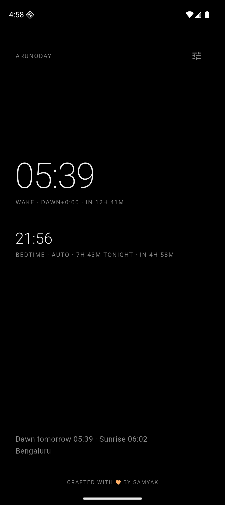
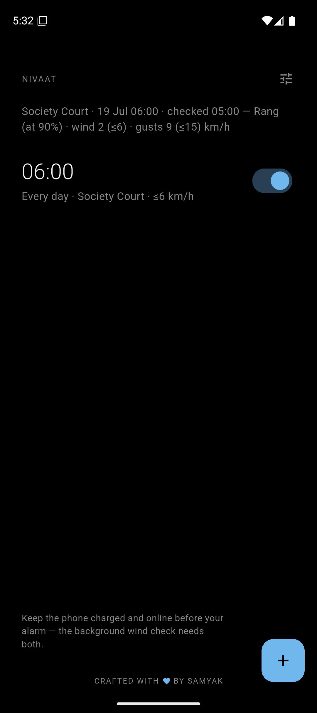

# weather-aware-alarm-apps

Two minimal, pitch-black alarm apps. One Flutter monorepo.

<p align="center">
  
  &nbsp;&nbsp;
  
</p>

<p align="center">
  <sub>Arunoday · Nivaat — Android (Pixel emulator). More shots under <code>screenshots/</code>.</sub>
</p>

## 🌄 Arunoday (अरुणोदय)

Wakes you at **civil dawn** — every day, at your location's real dawn, like humans woke for millions of years. Dynamic wake, fixed bedtime, computed so you naturally sleep ~7h in summer and ~9h in winter.

## 🌬️ Nivaat (निवात)

The badminton alarm. Rings **only if the wind at your court is low enough to play** — and the calmer the morning, the louder it rings. _"yathā dīpo nivāta-stho neṅgate"_ — like a lamp in a windless place that doesn't flicker (Gita 6.19).

## Why waking with the dawn works

Your body clock runs on one master signal: **morning light**. Decades of circadian
research keep landing on the same two levers for better sleep — a _consistent wake
time_ and _morning light exposure_ — and Arunoday hands you both in a single act.

- **Consistency you never have to think about.** Civil dawn drifts only ~1 minute
  per day, so "wake at dawn" is, in practice, a rock-steady wake time — one that also
  happens to arrive exactly when the light that sets your clock does. You get the
  regularity sleep scientists prize _and_ perfect light-alignment, for free. In a
  landmark camping study, waking near sunrise pulled people's melatonin timing into
  natural alignment with sunset — about the tightest, healthiest circadian rhythm
  there is.<sup>[1][2]</sup>
- **Sleep that breathes with the seasons — the way bodies actually want.** Because
  bedtime is fixed and wake follows dawn, you naturally sleep a little longer in
  winter and a little less in summer. That isn't a quirk, it's physiology: people
  sleep ~15–20 minutes longer per night and get ~30 minutes more REM in winter, and
  the swing shrinks the closer you live to the equator — precisely the curve Arunoday
  produces.<sup>[3][4]</sup>

No app can promise perfect sleep. Few give you the two things the evidence actually
agrees on — consistency and morning light — folded into one effortless habit.
Arunoday does.

<sub>Sources: [1] [Consistent wake time & circadian regulation](https://liveembody.com/blog/consistent-wake-up-time) ·
[2] [Circadian entrainment to the natural light–dark cycle (camping study, PMC)](https://www.ncbi.nlm.nih.gov/pmc/articles/PMC9756595/) ·
[3] [Humans need more winter sleep — Frontiers](https://www.frontiersin.org/news/2023/02/17/humans-dont-hibernate-but-we-still-need-more-winter-sleep) ·
[4] [Seasonal sleep changes — Healthline](https://www.healthline.com/health-news/seasonal-sleeping-why-we-need-more-rest-in-the-winter).
General sleep-hygiene evidence, not medical advice.</sub>

## Structure

```
packages/core     shared logic: solar math, sleep planner, wind engine, Open-Meteo, theme
apps/arunoday     dawn alarm app
apps/nivaat       wind alarm app
```

## Development

```sh
cd packages/core && flutter test        # all business logic is tested here
cd apps/arunoday && flutter run
cd apps/nivaat   && flutter run
```

`flutter run` targets whatever device is connected — a real phone over USB, or a virtual one:

```sh
# No iPhone needed — the iOS Simulator ships with Xcode:
flutter emulators --launch apple_ios_simulator

# No Android phone needed — the "pixel" emulator lives on this machine:
flutter emulators --launch pixel

# Then, from the app folder:
flutter run                             # single device: picked automatically
flutter devices                         # several connected: list ids…
flutter run -d <device-id>              # …and pick one
```

Simulators are perfect for UI and flows; alarm _reliability_ (Silent mode, locked-screen ring, battery behavior) still needs a real device.

### Real Android phone (`adb`)

`adb` lives in the Android SDK's `platform-tools`. If `adb: command not found`, add it to your PATH once (already done in this machine's `~/.zshrc`):

```sh
export ANDROID_HOME="$HOME/Library/Android/sdk"
export PATH="$ANDROID_HOME/platform-tools:$PATH"
```

```sh
adb devices                             # list connected phones (USB or Wi-Fi)
flutter run                             # builds + installs + launches on it
```

**Wireless (no cable).** On the phone: Developer options → **Wireless debugging → On** (phone and Mac on the same Wi-Fi).

- _First time only_ — pair: open "Pair device with pairing code", then on the Mac `adb pair <IP:PORT>` (the IP:PORT and 6-digit code shown _in that pairing dialog_). Once the Mac appears under the phone's "Paired devices", never pair again.
- _Each session_ — connect: take the IP:PORT from the **main** Wireless-debugging screen (different port than pairing) and run `adb connect <IP:PORT>`. Often `adb` auto-reconnects to a paired phone, so try `adb devices` first — if it's already listed, you're done.

A build note: `flutter run` prints a harmless `KGP` deprecation warning that originates inside the `alarm` plugin's own Gradle script — nothing on our side, safe to ignore until the plugin updates upstream.

See `SPEC.md` for the full locked v1 specification and the research behind every number, and `RUNNING.md` for how to run both apps on the local emulator/simulator.
